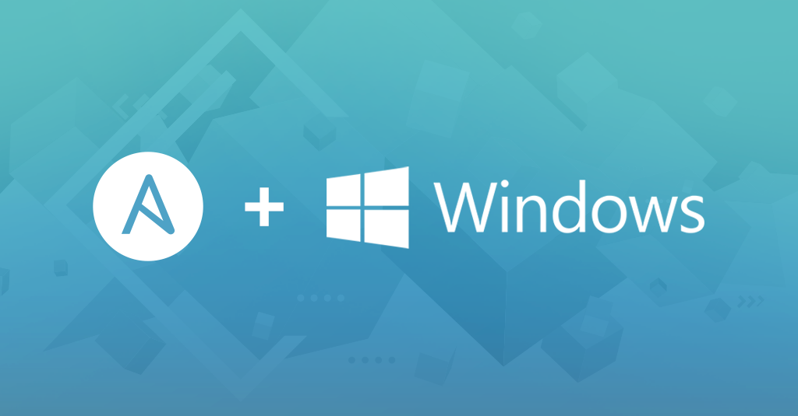

# Configure a Ansible Playbook

## Windows Test Environment



[Our Pre-made Playbooks](https://github.com/rune004/Ansible){ .md-button }

??? warning "Configure templates"

    ### Configure templates

    Setup the VMs that you want the playbook to deploy for you. This will have to be a full configuration of the functionality that you want from the VM. The playbook will not do anything to the VMs themselves, it will just clone the template of the configured VM.

    Machine   |  Name  |  User  |
    ----------|--------|--------|
    Windows Server Main | RPT-Main | Administrator |
    Windows Server Backup | RPT-Back | Administrator |
    Windows Client 1 | Client-1 | Bruger |
    Windows Client 2 | Client-2 | Bruger |
    Windows Client 3 | Client-3 | Bruger |

    Windows Server Main | Windows Server Backup |
    --------------------|-----------------------|
    AD-DC | AD-DC |
    DNS | DNS |
    Fully Updated | Fully Updated |

----------------------


??? info "Understand the variables"

    ### Understand the variables

    Variables    | Functions     |
    ------------ | ------------- |
    Win_Srv1 | The name of the new server VM |
    Win_10_1 | The name of the new client VM |
    apihost | Proxmox Server IP  |
    apiuser | Proxmox Username, password and method (PAM or PVE)  |
    apipass | Proxmox Password |
    prox_storage | Storage location on Proxmox Server |
    prox-node | The Proxmox Node to Deploy the VM to |
    disk_format | The format for the VM disk |
    timeout | Wait for the Proxmox server to clone the VM |
    pause | Give the Proxmox server some time to recover from each cloning |
    state | The State The VM Will Be Put Into After Cloning (Can also be present if you don't want more then one, can also be skipped if none is needed) |


??? warning "Set your variable"

    ### Set Your variables
    ```
    - set_fact:
            Win_Srv1: "Windows-ADDC-1" # The target 1 VM name
            Win_Srv2: "Windows-ADDC-2" # The target 2 VM name
            Win_10_1: "Windows-Client-1" # The target 3 VM name
            Win_10_2: "Windows-Client-2" # The target 4 VM name
            Win_10_3: "Windows-Client-3" # The target 5 VM name
            CloneWin_Srv1: "windowsservertemplate" # The 1 VM source
            CloneWin_Srv2: "windowsservertemplate2" # The 2 VM source
            CloneWin_10_1: "windowstemplate" # The 3 VM source
            CloneWin_10_2: "windowstemplate2" # The 4 VM source
            CloneWin_10_3: "windowstemplate3" # The 5 VM source
            apipass: "*" # The Password Used For Signing In To Proxmox
            apihost: "100.124.109.92" # The Proxmox Host IP Address
            apiuser: "root@pam" # The Proxmox User With Access
            prox_storage: "vms-ssd" # The Target Storage On Proxmox
            prox_node: "main" # The Target Node In The Proxmox Cluster
            disk_format: "qcow2" # The Format For The Disk .img
            timeout: "500" # The Task Can Take a While. Adapt
            pause: "10" # How long The Pause Between Tasks Is (Recommend to adjust high if your server is not so strong)
            state: "started" # The State The VM Will Be Put Into After Cloning (Can also be present if you don't want more then one, can also be skipped if none is needed)
    ```

??? info "What your variables a used for"

    ### What your variables a used for 
    The first section is for cloning the VM.

    The second section is for start the VM after it is done cloning.
    ```
    - proxmox_kvm:
        api_user    : "{{ apiuser }}"
        api_password: "{{ apipass }}"
        api_host    : "{{ apihost }}"
        clone       : "{{ CloneWin_Srv1 }}"   
        name        : "{{ Win_Srv1 }}"  
        node        : "{{ prox_node }}"
        storage     : "{{ prox_storage }}"
        format      : "{{ disk_format }}"
        timeout     : "{{ timeout }}"  
    - name: Pause for "{{ pause }}" seconds to clone the "{{ Win_Srv1 }}"
      ansible.builtin.pause:
        seconds: "{{ pause }}"

    ---------------------------------

    - name: start "{{ Win_Srv1 }}"
      proxmox_kvm:
        api_user: "{{ apiuser }}"
        api_password: "{{ apipass }}"
        api_host: "{{ apihost }}"
        name: "{{ Win_Srv1 }}"
        node: "{{ prox_node }}"
        state: "{{ state }}"
    - name: Pause for "{{ pause }}" seconds to start the "{{ Win_Srv1 }}"
      ansible.builtin.pause:
        seconds: "{{ pause }}"
    ```

--------------------------------

??? success "Fully made Playbook for Windows Test Environment"

    ### Fully made Playbook for Windows Test Environment
    Please note:

    That all of our playbooks has pre-defined "hosts" in this case it is proxmox.

    This is because in our ansible hosts file our Proxmox server is named proxmox.
    ```
    - name: Test Environment
      hosts: proxmox
      tasks:
       - set_fact:
            Win_Srv1: "Windows-ADDC-1" # The target 1 VM name
            Win_Srv2: "Windows-ADDC-2" # The target 2 VM name
            Win_10_1: "Windows-Client-1" # The target 3 VM name
            Win_10_2: "Windows-Client-2" # The target 4 VM name
            Win_10_3: "Windows-Client-3" # The target 5 VM name
            CloneWin_Srv1: "windowsservertemplate" # The 1 VM source
            CloneWin_Srv2: "windowsservertemplate2" # The 2 VM source
            CloneWin_10_1: "windowstemplate" # The 3 VM source
            CloneWin_10_2: "windowstemplate2" # The 4 VM source
            CloneWin_10_3: "windowstemplate3" # The 5 VM source
            apipass: "*" # The Password Used For Signing In To Proxmox
            apihost: "100.124.109.92" # The Proxmox Host IP Address
            apiuser: "root@pam" # The Proxmox User With Access
            prox_storage: "vms-ssd" # The Target Storage On Proxmox
            prox_node: "main" # The Target Node In The Proxmox Cluster
            disk_format: "qcow2" # The Format For The Disk .img
            timeout: "500" # The Task Can Take a While. Adapt
            pause: "10" # How long The Pause Between Tasks Is (Recommend to adjust high if your server is not so strong)
            state: "started" # The State The VM Will Be Put Into After Cloning (Can also be present if you don't want more then one, can also be skipped if none is needed)
        - proxmox_kvm:
            api_user    : "{{ apiuser }}"
            api_password: "{{ apipass }}"
            api_host    : "{{ apihost }}"
            clone       : "{{ CloneWin_Srv1 }}"   
            name        : "{{ Win_Srv1 }}"  
            node        : "{{ prox_node }}"
            storage     : "{{ prox_storage }}"
            format      : "{{ disk_format }}"
            timeout     : "{{ timeout }}"  
        - name: Pause for "{{ pause }}" seconds to clone the "{{ Win_Srv1 }}"
           ansible.builtin.pause:
            seconds: "{{ pause }}"
        - proxmox_kvm:
            api_user    : "{{ apiuser }}"
            api_password: "{{ apipass }}"
            api_host    : "{{ apihost }}"
            clone       : "{{ CloneWin_Srv2 }}"   
            name        : "{{ Win_Srv2 }}"  
            node        : "{{ prox_node }}"
            storage     : "{{ prox_storage }}"
            format      : "{{ disk_format }}"
            timeout     : "{{ timeout }}"  
        - name: Pause for "{{ pause }}" seconds to clone the "{{ Win_Srv2 }}"
          ansible.builtin.pause:
            seconds: "{{ pause }}"
        - proxmox_kvm:
            api_user    : "{{ apiuser }}"
            api_password: "{{ apipass }}"
            api_host    : "{{ apihost }}"
            clone       : "{{ CloneWin_10_1 }}"  
            name        : "{{ Win_10_1 }}"  
            node        : "{{ prox_node }}"
            storage     : "{{ prox_storage }}"
            format      : "{{ disk_format }}"
            timeout     : "{{ timeout }}"  
        - name: Pause for "{{ pause }}" seconds to clone the "{{ Win-10-1 }}"
          ansible.builtin.pause:
            seconds: "{{ pause }}"
        - proxmox_kvm:
            api_user    : "{{ apiuser }}"
            api_password: "{{ apipass }}"
            api_host    : "{{ apihost }}"
            clone       : "{{ CloneWin_10_2 }}"   
            name        : "{{ Win_10_2 }}"  
            node        : "{{ prox_node }}"
            storage     : "{{ prox_storage }}"
            format      : "{{ disk_format }}"
            timeout     : "{{ timeout }}"  
         - name: Pause for "{{ pause }}" seconds to clone the "{{ Win_10_2 }}"
          ansible.builtin.pause:
            seconds: "{{ pause }}"
        - proxmox_kvm:
            api_user    : "{{ apiuser }}"
            api_password: "{{ apipass }}"
            api_host    : "{{ apihost }}"
            clone       : "{{ CloneWin_10_3 }}"   
            name        : "{{ Win_10_3 }}"  
            node        : "{{ prox_node }}"
            storage     : "{{ prox_storage }}"
            format      : "{{ disk_format }}"
            timeout     : "{{ timeout }}" 
        - name: Pause for "{{ pause }}" seconds to clone the "{{ Win_10_3 }}"
          ansible.builtin.pause:
            seconds: "{{ pause }}"
        - name: start "{{ Win_Srv1 }}"
          proxmox_kvm:
            api_user: "{{ apiuser }}"
            api_password: "{{ apipass }}"
            api_host: "{{ apihost }}"
            name: "{{ Win_Srv1 }}"
            node: "{{ prox_node }}"
            state: "{{ state }}"
        - name: Pause for "{{ pause }}" seconds to start the "{{ Win_Srv1 }}"
          ansible.builtin.pause:
            seconds: "{{ pause }}"
        - name: start "{{ Win_Srv2 }}"
          proxmox_kvm:
            api_user: "{{ apiuser }}"
            api_password: "{{ apipass }}"
            api_host: "{{ apihost }}"
            name: "{{ Win_Srv2 }}"
            node: "{{ prox_node }}"
            state: "{{ state }}"
        - name: Pause for "{{ pause }}" seconds to start the "{{ Win_Srv2 }}"
          ansible.builtin.pause:
            seconds: "{{ pause }}"
        - name: start "{{ Win_10_1 }}"
          proxmox_kvm:
            api_user: "{{ apiuser }}"
            api_password: "{{ apipass }}"
            api_host: "{{ apihost }}"
            name: "{{ Win_10_1 }}"
            node: "{{ prox_node }}"
            state: "{{ state }}"
        - name: Pause for "{{ pause }}" seconds to start the "{{ Win_10_1 }}"
          ansible.builtin.pause:
            seconds: "{{ pause }}"
        - name: start "{{ Win_10_2 }}"
          proxmox_kvm:
            api_user: "{{ apiuser }}"
            api_password: "{{ apipass }}"
            api_host: "{{ apihost }}"
            name: "{{ Win_10_2 }}"
            node: "{{ prox_node }}"
            state: "{{ state }}"
        - name: Pause for "{{ pause }}" seconds to start the "{{ Win_10_2 }}"
          ansible.builtin.pause:
            seconds: "{{ pause }}"        
        - name: start "{{ Win_10_3 }}"
          proxmox_kvm:
            api_user: "{{ apiuser }}"
            api_password: "{{ apipass }}"
            api_host: "{{ apihost }}"
            name: "{{ Win_10_3 }}"
            node: "{{ prox_node }}"
            state: "{{ state }}"
    ```
--------------------------------

## LXC Container


??? warning "Set Your Variables"

    ### Set Your Variables
    Variables | Functions | 
    ------------ | ------------- | 
    Password | Proxmox Password  | 
    vmid | The LXC Container id  | 
    node | The Proxmox Node to Deploy the LXC Container to |
    api_user | Proxmox Username, password and method (PAM or PVE) |
    api_password | Reused Proxmox Password from Password |
    api_host | Proxmox Server IP |
    password | The LXC Container Root Password |
    hostname | The Name of the LXC Container |
    ostemplate | The LXC Template downloaded to the Proxmox server |
    cores | The amount of cores assigned to the LXC Container |
    memory | The amount of RAM assinged to the LXC Container |
    disk | The amount of disk space assigned to the LXC Container |
    storage | The storage location for the LXC Container |
    netif | The network settings for the LXC Container |
    nameserver | The DNS server for the  LXC Container |
    unprivileged | Select if the LXC Container should be privileged or unprivileged |
    validate_certs | Select if the LXC Container should interact with HTTP and HTTPS web services |
    onboot | Select if the LXC Container should boot when the Proxmox server has booted 
    description | Sets the description for the LXC Container |
    features | Setup extra arguments |

??? success "Fully made playbook for LXC Container"

    ### Fully made playbook for LXC Container
    Please note:

    That all of our playbooks has pre-defined "hosts" in this case it is proxmox.

    This is because in our ansible hosts file our Proxmox server is named proxmox.
    ```
    - hosts: proxmox
      tasks:
      - set_fact:
          Password: "*" # Password
      - name: Create container for testing
        community.general.proxmox:
          vmid: "5{{ lookup('password', '/dev/null chars=digits length=2') }}"
          node: main
          api_user: root@pam
          api_password: "{{ Password }}"
          api_host: main.pve
          password: "{{ Password }}"
          hostname: "test-{{ lookup('password', '/dev/null chars=ascii_lowercase,digits length=2') }}"
          ostemplate: 'local:vztmpl/ubuntu-22.04-standard_22.04-1_amd64.tar.zst'
          cores: 2
          memory: 4096
          disk: "40"
          storage: local-lvm
          netif: '{"net0":"name=eth0,gw=192.168.1.1,ip=dhcp,bridge=vmbr0"}'
          nameserver: 192.168.1.1
          unprivileged: yes
          validate_certs: no
          onboot: yes
          description: container for testing
          features:
           - nesting=1
    ```
