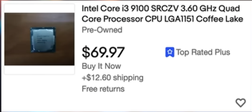

# Power Efficient Home Server

## Why care about power efficiency?

!!! tip "Save Money"

    Save money via running costs due to the server pulling less power from the wall, The server will output less heat and due to less heat the servers fans will not be running at 7200rpm, the server will therefore also run quietly.

## Platform (Motherboard & CPU)
!!! info "Motherboard & CPU"

    Building a power efficient server begins with, well, picking power efficient components. And that’s not as simple as buying a low TDP CPU and pairing it with a server motherboard.

    First things first, if you want to save on your utility bill, don’t buy old hardware, by old I mean pretty much anything older than Haswell or the 4th series of Intel CPUs.

    Older systems might be cheaper, but your savings will probably go towards paying the increased utility bill, even though older CPUs might have the same nominal TDP than the newer ones,they’re much less efficient at idle and might not support the power efficient C-States that the newer CPUs support.

 

!!! example "Newer or older hardware?"

    At the same time, newer doesn’t necessarily mean “more power efficient”, And recently we’ve seen the PC components like CPUs and graphic cards Become more and more power hungry for the sake of ‘performance’. 

    Pretty much any Intel CPU that is 6th gen or newer will be pretty efficient at idle, And even though the newer CPUs might be slightly more efficient, You will have to shell out more money for a newer motherboard and a more expensive CPU So if you’re okay with the performance of something like 6th or 7th gen CPUs, don’t chase the newer 12th and 13th CPUs purely because of the power efficiency.

### But what about AMD?

Well, when it comes to Intel vs. AMD, Intel systems tend to win When it comes to budget-ish systems, Since they tend to consume less than equivalent AMD Ryzen machines.

Ryzen CPUs also still seem to suffer from the idle freeze bug on Linux, Which can only be fixed reilably by disabling the power efficient C-states, Which is kind of counter-intuitive, That being said, you can still build a pretty power efficient system with a Ryzen CPU, And some users report as little as 7W power consumption with a 4350G. 

One more thing I want to mention is that the TDP spec means absolutely nothing for the real-world power consumption in a home server. TDP only describes the power consumption under load, And in a lot of cases, even that figure doesn’t match what you’d see in real-life use. 

Despite consuming upwards of 100W under load, Many modern processors can still enter a power-efficient idle state In which they sip less than 1W.

That also applies to the T-Series Intel CPUs These are pretty much the same chips as the non-T models, just capped to a smaller TDP.

This has no effect on the idle power consumption, so don’t pay more money for a T-series CPU because of the supposed power efficiency Since your server will most likely be idling most of the time,at least compared to a desktop PC.

 

The idle draw is exactly the figure we’re interested in and it can vary wildly depending on your motherboard, PCIe devices, power supply, and so on. 

Unfortunately, very few manufacturers and reviewers publish the idle power consumption figures, but luckily for us, there’s a whole community focused on building power efficient computers. 

And it can be found on this German forum called Hardwareluxx. The forum members even maintain a database of the most power efficient builds, sorted by consumption which can be a great help if you’re looking for power efficient components

## Ultra small-form-factor PCs

So let’s dive in As you can see, the most power efficient systems, ones that consume as little as 1 to 4 watts, are Intel NUCs, laptop motherboards and basically ultra small form factor PCs. 

Obviously, those computers are power efficient for a reason they don’t have the most beefy CPUs in them And the number of features and ports is also very limited. 

You’ll rarely find more than one SATA or M.2 slot, and PCIe is also usually out of the question. That’s the price you’ll have to pay for ultimate power efficiency, and if you’re okay with not having those features, then these options could be for you. 

These machines should still have plenty of power for Virtualization, Docker, Kubernetes, Proxmox, or even running a media server or a Home Assistant Instance But they’re probably not the best choice for a NAS since they lack expansion.

## miniITX Motherboards

If you want your home server to be a bit more capable, The next option is a desktop CPU and a miniITX motherboard MiniITX motherboards tend to have less ports and features than their ATX counterparts, and because of that they usually consume less power You might think that the difference between a miniITX motherboard and a full ATX mobo with the same CPU is negligible, Aaaand you’d be wrong.

 