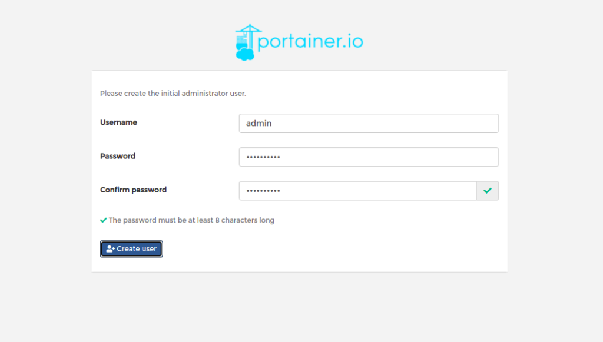
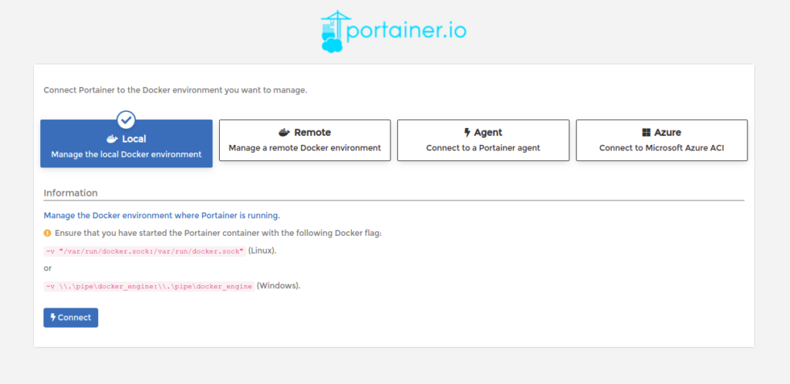
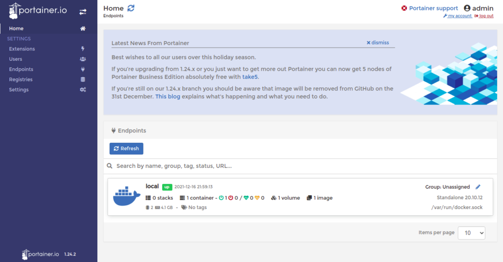

# Setup Portainer/Docker On Debain 11


??? warning "Prerequisites"

    ## Prerequisites

    * A server running Debian 11 
    * A root password configured on your server

??? example "Update and Upgrade"

    ## Update and Upgrade

    Update and Upgrade the debain 11 "server" to get the newest security updates. And to make sure that all repos are up to date.

    ```
    apt-get update -y

    apt-get upgrade -y
    ```

??? example "Install Docker CE"

    ## Install Docker CE
    Before installing Portainer, Docker CE must be installed on your server. You can install Docker CE by following the below steps:

    First, install the required dependencies using the following command:

    ```
    apt-get install apt-transport-https ca-certificates curl gnupg2 software-properties-common
    ```

    Next, add the Docker CE repository with the following command:

    ```
    curl -fsSL https://download.docker.com/linux/debian/gpg | gpg --dearmor -o /usr/share/keyrings/docker-archive-keyring.gpg
    echo "deb [arch=$(dpkg --print-architecture) signed-by=/usr/share/keyrings/docker-archive-keyring.gpg] https://download.docker.com/linux/debian \
    $(lsb_release -cs) stable" | tee /etc/apt/sources.list.d/docker.list > /dev/null
    ```

    Next, update the repository and install Docker CE with the following command:

    ```
    apt-get update -y
    apt-get install docker-ce docker-ce-cli containerd.io -y
    ```

    Once Docker is installed, verify the Docker installation using the following command:

    ```
    docker version
    ```

    You should see the following output:

    ```
    Client: Docker Engine - Community
     Version:           20.10.12
     API version:       1.41
     Go version:        go1.16.12
     Git commit:        e91ed57
     Built:             Mon Dec 13 11:45:48 2021
     OS/Arch:           linux/amd64
     Context:           default
     Experimental:      true

    Server: Docker Engine - Community
     Engine:
      Version:          20.10.12
      API version:      1.41 (minimum version 1.12)
      Go version:       go1.16.12
      Git commit:       459d0df
      Built:            Mon Dec 13 11:43:56 2021
      OS/Arch:          linux/amd64
      Experimental:     false
     containerd:
      Version:          1.4.12
      GitCommit:        7b11cfaabd73bb80907dd23182b9347b4245eb5d
     runc:
      Version:          1.0.2
      GitCommit:        v1.0.2-0-g52b36a2
     docker-init:
      Version:          0.19.0
      GitCommit:        de40ad0
    ```

??? example "Install Docker Compose"

    ## Install Docker Compose
    You will also need to install Docker Compose to your system. First, download the latest version of Docker Compose binary using the following command:

    ```
    wget https://github.com/docker/compose/releases/download/v2.2.2/docker-compose-linux-x86_64
    ```

    Next, copy the downloaded binary to the system path:

    ```
    cp docker-compose-linux-x86_64 /usr/local/bin/docker-compose
    ```

    Next, set executable permissions to the Docker Compose binary:

    ```
    chmod +x /usr/local/bin/docker-compose
    ```

    Next, verify the Docker Compose installation using the following command:

    ```
    docker-compose --version 
    ```

    You should see the following output:
    ```
    Docker Compose version v2.2.2
    ```

??? example "Install Portainer UI"

    ## Install Portainer UI
    First, create a volume to store Portainer data using the following command:

    ```
    docker volume create portainer_data
    ```

    Next, run the following command to download the Portainer image from the Docker Hub registry, create a container, and expose the container on port 9000:

    ```
    docker run -d -p 8000:8000 -p 9000:9000 --name=portainer --restart=always -v /var/run/docker.sock:/var/run/docker.sock -v portainer_data:/data portainer/portainer
    ```

    You should see the following output:

    ```
    Unable to find image 'portainer/portainer:latest' locally
    latest: Pulling from portainer/portainer
    94cfa856b2b1: Pull complete 
    49d59ee0881a: Pull complete 
    a2300fd28637: Pull complete 
    Digest: sha256:fb45b43738646048a0a0cc74fcee2865b69efde857e710126084ee5de9be0f3f
    Status: Downloaded newer image for portainer/portainer:latest
    69d06a5c41851cc85df1924aa77566d2f38978faad5c27f52e089af8a0dc931e
    ```

    You can verify the running container using the following command:

    ```
    docker ps
    ```

    You should see the following output:

    ```
    CONTAINER ID   IMAGE                 COMMAND        CREATED          STATUS          PORTS                                                                                  NAMES
    69d06a5c4185   portainer/portainer   "/portainer"   12 seconds ago   Up 11 seconds   0.0.0.0:8000->8000/tcp, :::8000->8000/tcp, 0.0.0.0:9000->9000/tcp, :::9000->9000/tcp   portainer
    ```

??? example "Access Portainer UI"

    ## Access Portainer UI
    Now, open your web browser and access the Portainer UI using the URL http://your-server-ip:9000. You should see the following page:

    

    Set your admin user and password and click on the Create user button. You will be asked to select the Docker environment that you want to manage:

    

    Select the local environment and click on the Connect button. You should see the Portainer UI on the following page:

    

??? succes "Conclusion"

    ## Conclusion

    Congratulations! You have successfully installed Portainer UI on Debian 11. You can now create, deploy and manage Docker containers from a web browser.