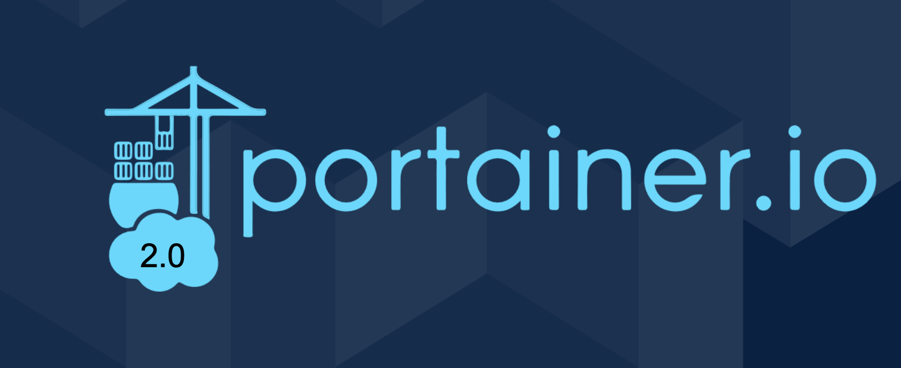

# What is Portainer?

??? info "Portainer"

    Portainer is a lightweight management UI which allows you to easily manage your different Docker environments (Docker hosts or Swarm clusters). Portainer is meant to be as simple to deploy as it is to use. 
    
    It consists of a single container that can run on any Docker engine (can be deployed as Linux container or a Windows native container, supports other platforms too). 
    
    Portainer allows you to manage all your Docker resources (containers, images, volumes, networks and more) ! It is compatible with the standalone Docker engine and with Docker Swarm mode.

## Top Features

??? abstract "Authentication"

    ### Authentication

    Portainer supports three different methods for user authentications. The first is the internal method, where the user management is handled by Portainer and stored in the Portainer data folder. 
    
    The second method is LDAP, where the users are managed by an external LDAP server, such as ActiveDirectory. The only drawback that I can see for the LDAP authentication is that it cannot be configured using environment variables. 
    
    The final authentication method is to use OAuth to perform the authentication. (This feature requires purchasing one of the paid extensions.)

??? tips "Manage multiple clusters"

    ### Manage multiple clusters (endpoints)

    As shown in the image below, Portainer supports managing multiple Docker Swarm clusters (called endpoints) using its user interface. 
    
    This feature is very helpful in case you would like to manage clusters for different environments (such as testing, staging, and production) in a single user interface.

??? abstract "Template"

    ### Template

    Portainer allows the end user to deploy common Docker Swarm services or Docker containers from predefined templates. These templates are either shipped with Portainer itself or can be defined by the end users themselves. The user-defined templates can be used to deploy services using three modes:

    * Single Docker containers — by defining all the needed configurations to create the container
    * Docker Swarm services — by providing a link to the stack or service file
    * Docker containers — using a docker-compose file

??? info "View Docker Resources"

    ### View Docker Resources

    Another important feature provided by Portainer is the ability to view, interact, and manage Docker Swarm resources such as Swarm service, Docker networks, Swarm stacks, containers, and Docker images.

    Portainer allows the end user to view these resources and interact with them in a way that is easy, intuitive, and simple. As a result, the end user does not need to connect to the Swarm clusters and move from one node to another to validate and check the services and the containers. 
    
    For instance, the end user can list all the services deployed to a given cluster, update the configuration items of these services, and stop and start the services as needed from the web interface.

??? tips "Perform Actions On Containers"

    ### Perform Actions On Containers

    This feature is highly related to the previous one, but since the actions that can be performed on the containers are super important and helpful, I want to highlight these features.

    Usually in Docker Swarm clusters, if an engineer would like to inspect a given container, check the container logs, or connect to the shell inside the Docker container, they need to perform the following actions. 
    
    First, connect to a manager node. Then check where are the containers of the service are deployed (in which worker node). After that, connect to the worker node and perform the action needed on the container.

    All these actions are not needed when hosting Portainer. The same goal can be achieved directly from the web interface, and there is no need to connect to any cluster node.

## Paid Extensions

??? danger "Paid Extensions"

    Portainer can be extended by purchasing and enabling extra plugins. The list of the available Portainer plugins is described below.

??? danger "Registry Manager extension"

    ### Registry Manager extension

    This plugin extends Portainer and provides the end users with the capability to browse the defined external Docker registries and manage their resources. 
    
    Once the plugin is installed and enabled, users are able to browse the registries, explore repositories and Docker images, manipulate the tags that are attached to the repositories and images, add new tags, retag an image, and delete existing tags.

    The Registry Manager plugin has a simple and intuitive GUI that makes managing the Docker registry and the Swarm clusters easier and can be done from a single interface. On the other hand, there is still room for improvement in the plugin. For instance, the plugin does not support automating the Docker registry clean-up and the removal of old and unneeded Docker images. 
    
    This feature is very important if the Docker registry is used in the development process and engineers are building Docker images from the feature branches of the applications. In that case, it would be nice to have a feature in the plugin to remove all images that belong to the feature branches after 30 days.

??? danger "Role-Based Access Control extension"

    ### Role-Based Access Control extension

    The Role-Based Access Control extension (RBAC) extends Portainer authorization features and allows the end user to assign roles to users or teams within an endpoint or group of endpoints. There are multiple different predefined roles that are available once the plugin is installed and enabled. These roles are described below.

    * Endpoint administrator: This role provides complete control over the resources deployed within a given endpoint (only the resources and Portainer internal settings are not included).
    * Standard user: This role has complete control over the resources that are deployed by the user himself or by one of the members of the team that the user belongs to.
    * Helpdesk: This role provides read-only permissions to all the resources within the selected endpoint.
    * Read-only user: This role provides read-only permissions to a subset of the resources within the selected endpoint.

    In addition to the above roles, Portainer defines a built-in role of Administrator that grants access permission not only to an endpoint resource but also to the Portainer settings and all the resources in all defined endpoints.

    In my opinion, this plugin is a good addition to the Portainer web interface, However, I am missing the following features that could improve this plugin further.

    * The ability to create custom roles
    * The ability to grant users manage permissions to a subset of the resources within an endpoint

??? danger "External Authentication extension"

    ### External Authentication extension

    This plugin can be used to extend the authentication methods supported by Portainer. In case the internal user management is considered to be too much work and the LDAP server is not available, this plugin can be used to manage the user authentication using an OAuth service.

    Once the plugin is installed and enabled, an additional authentication option within Portainer settings will be available. The OAuth option adds the ability to connect Portainer to Microsoft Azure AD, Google Suite/Cloud Authentication, and GitHub Authentication. Furthermore, the plugin allows using the custom option, where you can connect to any OAuth provider by imputing the correct URI fields.