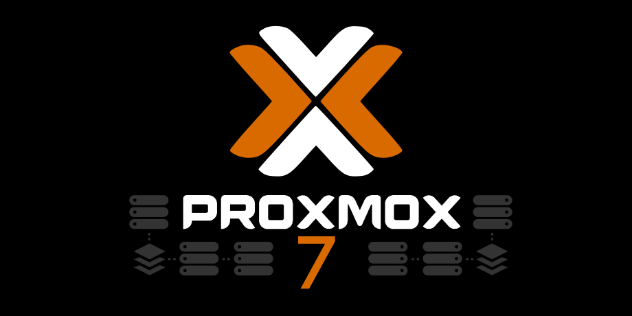

# What is Proxmox?

??? info "Proxmox VE"

    Proxmox VE is a complete opensource server virtualization management solution. It offers the ability to manage virtual server (VPS) technology with the Linux OpenVZ and KVM technologies. Proxmox VE offers a web interface accessible after installation on your server which makes management easy, typically needing only a few clicks.

    Proxmox VE was developed by Proxmox Server Solutions in Austria under the Internet Foundation of Austria and is released under the GNU General Public License. Since it’s an opensource solution it can be customized as per your requirements.

## Proxmox VE Features

??? abstract "Management"

    ### Management
    Proxmox VE offers a simple web based management interface which is accessible after intstallation on the server. There is no need to install any additional tools or additional management nodes or external database. The management is done through the web interface based on a javascript framework and allows the administrator to control all the features.

    **Features of Management Interface**

    * VNC console, SSL support
    * Based on Javascript Framework
    * Multiple Authentication methods
    * Dynamic updates of Resources
    * Create Virtual Servers & Containers
    * Handles thousands of VMs with Search capability
    * Role based user and permission management.

??? abstract "Flexible Storage"

    ### Flexible Storage

    Promox offers a flexible storage model. The virtual machine images can either be stored on one or several local storage on shared storages like NFS and SAN.

    Storing the Virtual Machines on shared storage allows for live migrations of running VMs with no down time.

    **Proxmox VE supported storage model**

    * ZFS
    * NFS Share
    * Ceph RBD
    * ISCI target
    * GlusterFS
    * LVM Group
    * Director ( storage on existing file system )
 
??? tips "Networking"

    ### Networking

    Proxmox VE uses a bridged networking model. All VMs can share the same bridge as if virtual cables from each guest were plugged into the same switch. The bridge is then connected to the physical network adapters for the host server to which are assigned the ( TCP / IP ) network configuration so that the VMs can communicate to the outside world.

    Proxmox VE supports VLANS , bonding and network aggregations which allows you to build complex flexible virtual networks for the hosts leveraging the full power of the Linux network stack.

??? abstract "Backup & Restore"

    ### Backup & Restore

    Proxmox VE carries an integrated backup tool called as “vzdump” which creates snapshots of virtual guests both for Openvz & KVM. The vzdump tool creates a tarball of the VM or CT data that includes the virtual disks and all the configuration data.

    **Key points**

    * Live backup
    * Backups can be scheduled
    * Graphical User Interface for Backup operations
    * Graphical User Interface for Restore operations
    * command line interface available
    * Monitoring via GUI

??? info "Live Migration & High Availability Cluster"

    ### Live Migration & High Availability Cluster

    Proxmox VE High Availability Cluster enables the definition of high available virtual servers. With the implementation of a cluster you can balance the workload on different hosts, increasing availability of virtual machines.

    If a virtual machine or container (VM or CT) is configured as HA and the physical host fails, the VM is automatically restarted on one of the remaining Proxmox VE Cluster nodes. In case of hardware maintenance, you can move the virtual machines on another node without any downtime, (or limited downtime).

    We can move running virtual servers from one physical host to another without downtime.

    #### For KVM based containers

    The migration of a virtual machine, running from one physical host to another, is done without any interruption. In order to use the live migration, all virtual disks must reside on shared storage, between hosts, as a SAN or NAS.

    #### For OpenVZ containers

    It’s possible to achieve containers migration without downtime, even using local storage, so shared storage is not required. (No San or Nas)
