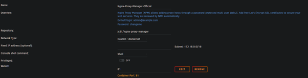
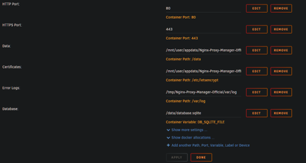
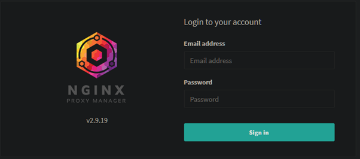
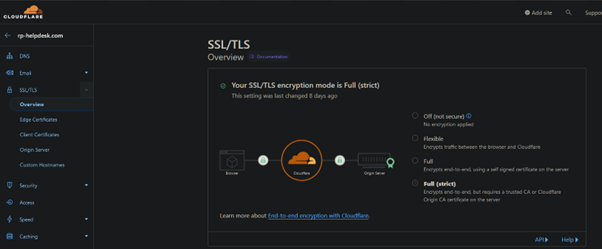
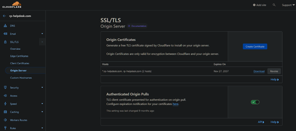
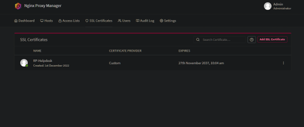
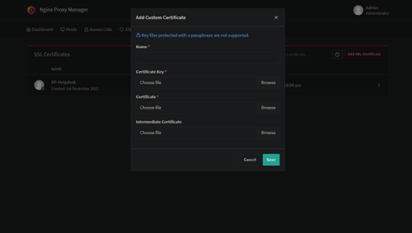
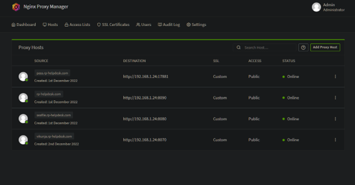

# Setup Nginx Proxy Manager on Unraid


??? example "Setup Nginx Proxy Manager on Unraid"

    ## Setup Nginx Proxy Manager on Unraid

    * Go to the CA Apps Tab

    * Search for Nginx-Proxy-Manager-Official

    * Install from mgutt's Repository

    You should see a page like this

    

    

??? example "Configure Nginx Proxy Manager"

    ## Configure Nginx Proxy Manager

    ### Login the first time

    * Go to the WebGui of Nginx Proxy Manager

    

    * Login the first time with the default login details

    ```
    Username: admin@example.com
    Password: changeme
    ```

    * Change your login details

    ### Getting Cert and Keys from Cloudflare

    * Login into your cloudflare account 

    * Go to the domain you want to use for Nginx Proxy Manager.

    * Then I recommend that you change your SSL/TLS settings to Full(strict)

    

    * Next go to Origin Server 

    * Create your own Custom Certificates 
    
    

    > I use rsa 2048 for my own sites and 15 years vaild

    * Download the Cert and Key 

    > * Copy and paste the code Cloudflare gives you
    >
    > * Save it into 2 files Cert.pem and Key.pem (Just use notepad)
    >
    > **Make sure you get the files right**


    ### Setting Nginx Proxy Manager up with Cert and keys

    * Go to the WebGui of Nginx Proxy Manager

    * Navigate to SSL Certificates
    
    

    **Don't press the add button in the middel of the screen**

    * Use the add SSL Certificate under the admin icon

    * Pick Custom and you should see this 

    

    * Give it a name, and add the 2 files from Cloudflare

    **Again make sure you get the files right**

    ## You can now start to add your domain site and sub-domains

         
