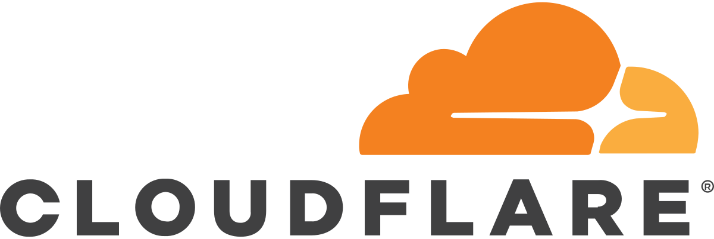

# Cloudflare Tunnel



??? info "What is Argo tunnels?"

    ## What is Argo tunnels?

    Argo Tunnel creates a secure, outbound-only connection between your services and Cloudflare by deploying a lightweight connector in your environment. With this model, your team does not need to go through the hassle of poking holes in your firewall or validating that traffic originated from Cloudflare IPs.

??? warning "Requirements"

    ### Requirements

    For this setup, you need to have a domain that is managed by Cloudflare, and can be done on the free plan.

??? example "Create App Folder"

    ### Create App Folder

    First we need to make sure we have the app folder ready with the correct permissions. Thanks to this tip from our discord user @noodlemctwoodle, you can use the following command in the Unraid terminal to create the folder and set the correct permissions:

    ```
    mkdir -p /mnt/user/appdata/cloudflared/ && chmod -R 777 /mnt/user/appdata/cloudflared/
    ```

??? example "Authorise Cloudflared"

    ### Authorise Cloudflared

    In Unraid terminal, run the following command to authorize Cloudflared with the Cloudflare site you want to set up with a tunnel.

    ```
    docker run -it --rm -v /mnt/user/appdata/cloudflared:/home/nonroot/.cloudflared/ cloudflare/cloudflared:latest tunnel login
    ```

    It will print out a link to Cloudflare. Put this link in your web browser, and select which domain you want to use. Then, the daemon will automatically pull the certificate.


??? example "Create a tunnel"

    ### Create a tunnel

    Now we need to create a tunnel. To do this, we will run another command from the Unraid terminal:

    ```
    docker run -it --rm -v /mnt/user/appdata/cloudflared:/home/nonroot/.cloudflared/ cloudflare/cloudflared:latest tunnel create TUNNELNAME
    ```

    This will create your tunnel's UUID.json file, which contains a secret used to authenticate your tunnelled connection with Cloudflare. The JSON file is only needed for running the tunnel, but any tunnel modifications require the cert.pem.

    Make sure you copy your UUID, as this will be used in later steps. It can always be found later by the name of the JSON file.

??? example "Create the config.yaml"

    ### Create the config.yaml

    Now we need to create a config.yaml to configure the tunnel

    ```
    nano /mnt/user/appdata/cloudflared/config.yml
    ```

    Now paste in the following and amend your reverse proxy IP:PORT, tunnel UUID and domain name if applicable

    * if you have an ssl certificate on your reverse proxy, you need to pass in your domain name that the SSL cert is under

    * if you want to proxy to an http server, use the commended ingress rule

    * if you want to disable ssl verification, add noTLSVerify under originRequest

    ```
    tunnel: UUID
    credentials-file: /home/nonroot/.cloudflared/UUID.json

    # NOTE: You should only have one ingress tag, so if you uncomment one block comment the others

    # forward all traffic to Reverse Proxy w/ SSL
    ingress:
      - service: https://REVERSEPROXYIP:PORT
        originRequest:
          originServerName: yourdomain.com

    #forward all traffic to Reverse Proxy w/ SSL and no TLS Verify
    #ingress:
    #  - service: https://REVERSEPROXYIP:PORT
    #    originRequest:
    #      noTLSVerify: true

    # forward all traffic to reverse proxy over http
    #ingress:
    #  - service: http://REVERSEPROXYIP:PORT
    ```

??? example "Install cloudflared in Unraid"

    ### Install cloudflared in Unraid

    Now, we need to install the app inside the Unraid UI.

    * Go to the CA Apps Tab

    * Search for cloudflared

    * Install from aeleos' Repository

    * Change the Repository: line to:

    ```
    cloudflare/cloudflared:latest
    ```
 
    Now we need to change the "Post Arguments". To do this we need to enable the "Advanced View" in the top right corner.

    * You should see the below command inside of "Post Arguments". Replace UUID the the UUID for your tunnel generated in step 2.

    ```
    Post arguments: 
    tunnel run UUID
    ```

    We also need to make a docker net in Unraid so we can later connect Nginx Proxy Manager.

    Open the terminal for the unraid server and paste the code below, with changes made to the name of the network.

    ```
    docker network create Your-name-for-the-network 
    ```

    Now pick the network you made from the drop down menu when you are setting up the post arguments.

    Now you can start your container and if all done correctly with no errors, you should have a running tunnel!

??? example "Setting up your DNS records"

    ### Setting up your DNS records

    The next step will be to edit your domain DNS records.

    * If you have an A record already, you can remove this as it is now not needed.

    * Replace your A record with a CNAME record, that points to the domain root (@) and for the content, you need to add UUID.cfargotunnel.com (inserting your UUID that was copied earlier).

    Type | Name | Value | TTL | Status |
    -----|------|-------|-----|--------|
    Cname | @ | UUID.cfargotunnel.com | Automatic | { width="50" } |
    Cname | plex | @ | Automatic | { width="50" } |
    Cname | portainer | @ | Automatic | { width="50" } |
    Cname | radarr | @ | Automatic | { width="50" } |
    Cname | sonarr | @ | Automatic | { width="50" } |

    You should now be able to access all of your apps without needed a port forward!