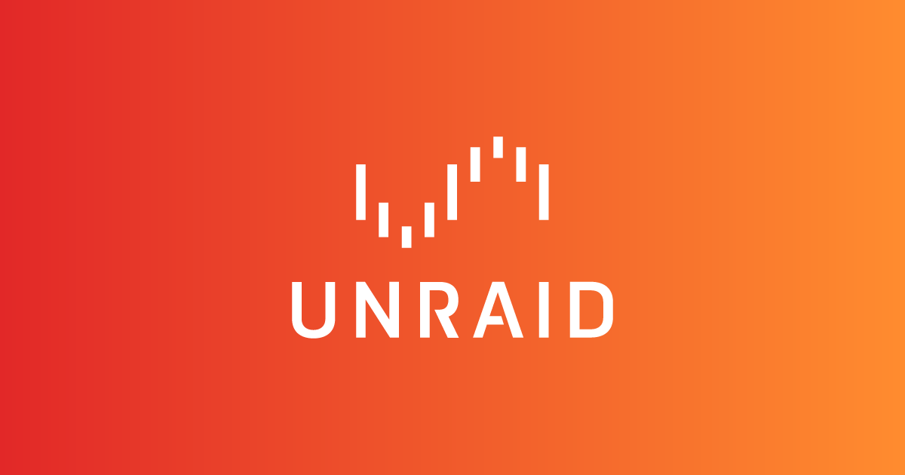

# What is Unraid?

??? info "Network Attached Storage (NAS) server"

    ## Network Attached Storage (NAS) server

    * A Network Attached Storage (NAS) server is a highly accessible data storage server that allows for the storage of information in one location. With a NAS server, you can work on ‘computer A’ without worrying about a file on ‘computer B’ in another room that you need to access. Simply download it from your network’s file server and access from any device.

    * Most NAS servers include data redundancy, usually in the form of a RAID array that allows for the failure of one or more hard drives. As the name implies, Unraid does not make use of a RAID array. Instead, it creates data redundancy for each bit in the storage array using a parity drive.

    * An APPLICATION SERVER leverages Docker to host applications ranging from home automation hubs to media servers like Plex. A VM Host uses a hypervisor to provide hardware virtualization and allows hardware to be passed over to the guest OS, letting them utilize hardware that Unraid cannot.

??? note "The Unraid Parity-Protected Array"

    ## The Unraid Parity-Protected Array

    With Unraid, your data is stored in the drive array. This is a parity-protected drive allowing for the restoration of data in the event of a failure. UnRAID also grants you permission to set up the array using 0 parity drives, 1 parity drive, or 2 parity drives, with 0 providing no protection. 
    
    Essentially, the number of parity drives you have determines how many drive failures your array can withstand before entirely rebuilding. The blog will be focused on a single parity drive, which creates parity bits across all drives using an XOR calculation.

    Unraid writes files entirely to a single disk, as opposed to typical RAID levels, which stripe data over all disks in the array. Because it’s just a regular file system and a single disk doesn’t rely on the others, even if you have a catastrophic failure and lose more drives than your array protects, you can still recover data on the drives that haven’t failed. 
    
    As the data is not striped, you can have disks of various sizes in your array and they will all be used to their full potential. By allowing drives to spin down when not in use, Unraid helps you save energy. Not every drive needs to be spun up even when data is being written. The only requirement is that the parity drive has at least the same capacity as the array’s largest drive.

??? info "User Shares"

    ## User Shares

    Unraid allows you to arrange your data by creating shares. Each share can contain data stored to any drive in the array, but it will appear as a single folder when viewed from a Windows machine. You can also specify privacy levels for these shares, as well as user access limits.

??? warning "Cache"

    ## Cache

    For a cache drive, you’ll usually utilize a SATA or NVME SSD. However, even a regular hard disk will enhance server write times. This is because reading the parity bit, computing the new parity bit, and waiting for the hard drive platter to spin back around to write the bit are all part of the writing process. This is referred to as ‘read-modify-write’ (RMW for short). 
    
    Unraid now features a new mode called ‘reconstruct write,’ in which data is quickly written, all other data disks are read, and parity is determined before being written. There’s no need to wait for the platters to rotate! Also, each drive does not have double I/O. Rather than adjusting parity like before, it is being built from the ground up.

    > Each share can contain data stored to any drive in the array, but it will appear as a single folder when viewed from a Windows machine.

    A filesystem that spans two 500 GB devices and one 1 TB device, for example, could provide RAID1 for all data, whereas a filesystem that spans a 1 TB device and a single 500 GB device could only provide RAID1 for 500 GB of data.

??? note "Docker & Virtual Machines (VM)"

    ## Docker & Virtual Machines (VM)

    Docker engine is built into Unraid, and acts to manage images and resources. It also virtualizes the operating system and uses namespaces to isolate. 

    The Docker image self-contains application and its dependencies. 

    A Docker container is a running instance of a docker image. Its Hypervisor virtualizes the hardware, allowing the host operating system to share resources between different virtual machines.

    A new operating system needs to be installed for each VM you run. Keep in mind, there are hard drive and other resource requirements. VM doesn’t use all its allocated resources all the time and all dependencies need to be reinstalled on each VM, which entails no dependency sharing.